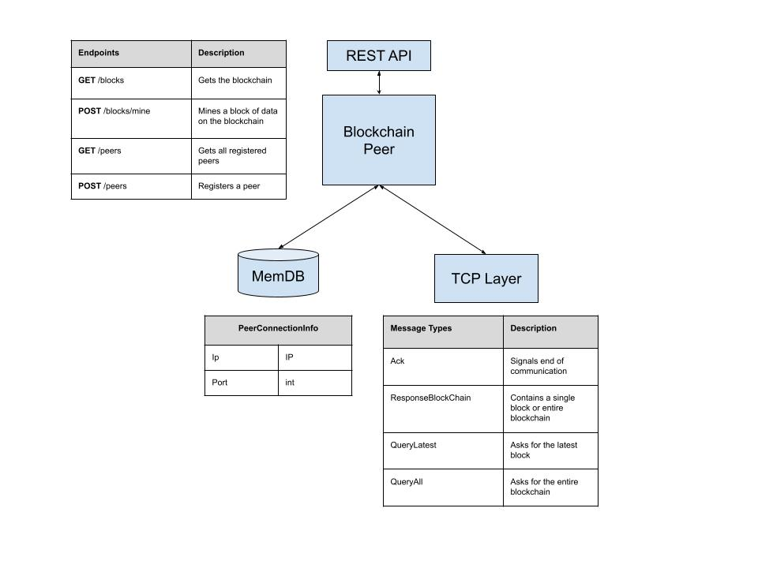

# blockchain-go
An exercise in creating a blockchain written in Go.

## Architecture
### Components

The blockchain peer hosts a REST API for clients to interact with. Connection info to other peers are stored in an 
in-memory database. The peer communicates with other peers over TCP to synchronize everyone's blockchain.

### Design Patterns
The `tasks` package handles peer interactions via `Task` commands. This package implements the command design pattern.


## Quick Start
### Usage
```shell
% blockchain-go http_port tcp_port
```
where `http_port` is the port to host the REST API and `tcp_port` is the port to listen for TCP connections from 
other peers.

### Example
```shell
% blockchain-go 8081 1111
```

## REST API
Use the REST API to communicate with a peer.
### Endpoints
- GET /blocks - Gets the blockchain
- POST /blocks/mine - Mines a block of data on the blockchain
- GET /peers - Gets all registered peers
- POST /peers - Registers a peer

Download the [Postman collection](blockchain_go.postman_collection.json) for details.
